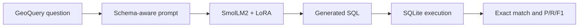

# Text-to-SQL with SmolLM2: LoRA Fine-Tuning

Phase 2 implementation of parameter-efficient fine-tuning for executable SQL generation.

**Hongyu Zhou · MRes Computer Science**

[English](#english) | [中文](#中文)

[Open the Phase 2 notebook](llm_for_sql.ipynb) · [View the complete Phase 1-4 study](https://github.com/torres953190868/text-to-sql-llm/tree/all-phases)

## English

### Overview

This branch focuses exclusively on Phase 2: adapting `HuggingFaceTB/SmolLM2-360M-Instruct` to GeoQuery text-to-SQL with LoRA and completion-only supervised fine-tuning.

The notebook contains the complete Phase 2 workflow: data preparation, schema-aware prompting, LoRA training, SQLite execution-based evaluation, and error analysis. Baseline prompting and CFG ablations are isolated on the [`all-phases`](https://github.com/torres953190868/text-to-sql-llm/tree/all-phases) branch so the main implementation remains concise and reproducible.

### Results

The values below come from the recorded full experiment. Exact match compares executed query results rather than requiring identical SQL strings. Executable SQL is the proportion of generated queries accepted by SQLite.

| Split and inference setup | Exact Match | Executable SQL | Micro F1 | Macro F1 |
|---|---:|---:|---:|---:|
| Development, LoRA + zero-shot | **69.39%** | **89.80%** | **0.5567** | **0.7005** |
| Test, LoRA + few-shot | **38.35%** | **90.32%** | **0.3390** | **0.4091** |

On the development set, LoRA improved exact match by **34.70 percentage points** and Micro F1 by **0.3954** over the base-model prompting result recorded on the complete-study branch.

### What I Built

- A GeoQuery preprocessing pipeline that expands variable placeholders and preserves the train/dev/test split.
- Schema-aware zero-shot training prompts and zero-shot or few-shot inference prompts.
- LoRA adapters for the attention projections: `q_proj`, `k_proj`, `v_proj`, and `o_proj`.
- A custom completion-only collator that masks prompt tokens and trains only on SQL completions.
- An evaluator that executes generated SQL against SQLite and calculates precision, recall, F1, result-set exact match, and SQL executability.
- Development and held-out test evaluation with deterministic greedy decoding and error inspection.

### Training Configuration

| Component | Configuration |
|---|---|
| Base model | `HuggingFaceTB/SmolLM2-360M-Instruct` with 361.8M parameters |
| Dataset | GeoQuery: 549 train / 49 dev / 279 test |
| LoRA | Rank 64, alpha 128, dropout 0.1 |
| Target modules | `q_proj`, `k_proj`, `v_proj`, `o_proj` |
| Trainable parameters | 13,107,200 / 374,928,320, approximately 3.50% |
| Optimisation | 5 epochs, learning rate `2e-4`, cosine schedule, 10% warm-up |
| Effective batch size | 16: batch size 4 with 4 gradient accumulation steps |
| Maximum sequence length | 512 tokens |
| Objective | Completion-only causal language modelling |
| Best recorded validation loss | 0.065445 at epoch 5 |

### Pipeline

The completion-only collator locates the `SQL:` response marker, masks all prompt and padding tokens with `-100`, and calculates loss only on the target SQL sequence.

### Evaluation Design

1. Build a prompt containing the GeoQuery database schema.
2. Generate SQL deterministically with greedy decoding.
3. Extract the generated `SELECT` statement.
4. Execute predicted and gold SQL against the same SQLite database.
5. Compare result sets and retain representative syntax and semantic errors.

This execution-based design gives semantically equivalent queries credit even when their SQL strings differ.

### Run the Project

A CUDA-capable GPU is strongly recommended.

1. Clone the repository and remain on the `main` branch.
2. Open [`llm_for_sql.ipynb`](llm_for_sql.ipynb) in Jupyter, Google Colab, or Kaggle.
3. Select a GPU runtime.
4. Run all cells from top to bottom.

The notebook installs `transformers`, `datasets`, `trl`, and `peft`, downloads missing GeoQuery assets, trains the LoRA adapter, and evaluates the fine-tuned model. CPU execution is practical for data preparation but not for the training experiment.

### Branches

| Branch | Purpose |
|---|---|
| `main` | Focused Phase 2 LoRA implementation |
| [`all-phases`](https://github.com/torres953190868/text-to-sql-llm/tree/all-phases) | Complete Phase 1-4 experiments, including prompting and CFG ablations |

### Limitations and Next Steps

- GeoQuery covers one small domain and does not establish cross-database generalisation.
- The development set contains only 49 examples; repeated seeded runs would provide a stronger variance estimate.
- Future work should evaluate schema linking, batched inference, and transfer to Spider or BIRD.

## 中文

### 项目概述

主分支只聚焦 Phase 2：使用 LoRA 和 completion-only 监督微调，将 `HuggingFaceTB/SmolLM2-360M-Instruct` 适配到 GeoQuery Text-to-SQL 任务。

Notebook 包含完整的 Phase 2 流程：数据准备、包含数据库 Schema 的提示构造、LoRA 训练、基于 SQLite 执行结果的评估和错误分析。Phase 1 的基础提示实验以及 Phase 3、4 的 CFG 消融实验单独保存在 [`all-phases`](https://github.com/torres953190868/text-to-sql-llm/tree/all-phases) 分支，让主分支保持精简且便于复现。

### 实验结果

下列数值来自完整实验的已保存输出。完全匹配率比较 SQL 的实际查询结果，而不是要求 SQL 字符串完全相同；SQL 可执行率表示生成查询能够被 SQLite 正确执行的比例。

| 数据划分与推理方式 | 完全匹配率 | SQL 可执行率 | Micro F1 | Macro F1 |
|---|---:|---:|---:|---:|
| 开发集，LoRA + zero-shot | **69.39%** | **89.80%** | **0.5567** | **0.7005** |
| 测试集，LoRA + few-shot | **38.35%** | **90.32%** | **0.3390** | **0.4091** |

在开发集上，LoRA 相比完整实验分支中的基础模型提示结果，将完全匹配率提高了 **34.70 个百分点**，Micro F1 绝对提升 **0.3954**。

### 我完成的工作

- 构建 GeoQuery 预处理流程，展开变量占位符并保留 train/dev/test 划分。
- 设计包含数据库 Schema 的 zero-shot 训练提示，以及 zero-shot 或 few-shot 推理提示。
- 在 `q_proj`、`k_proj`、`v_proj` 和 `o_proj` 注意力投影层上应用 LoRA。
- 实现 completion-only collator，屏蔽提示词 token，只对 SQL 答案计算训练损失。
- 实现 SQLite 执行式评估器，统计 Precision、Recall、F1、结果完全匹配率和 SQL 可执行率。
- 使用确定性的 greedy decoding 完成开发集、独立测试集评估和错误分析。

### 训练配置

| 项目 | 配置 |
|---|---|
| 基础模型 | `HuggingFaceTB/SmolLM2-360M-Instruct`，3.618 亿参数 |
| 数据集 | GeoQuery：549 train / 49 dev / 279 test |
| LoRA | rank 64，alpha 128，dropout 0.1 |
| 目标模块 | `q_proj`、`k_proj`、`v_proj`、`o_proj` |
| 可训练参数 | 13,107,200 / 374,928,320，约 3.50% |
| 优化配置 | 5 epochs，学习率 `2e-4`，cosine scheduler，10% warm-up |
| 有效 batch size | 16，即 batch size 4 x 梯度累积 4 |
| 最大序列长度 | 512 tokens |
| 训练目标 | Completion-only causal language modelling |
| 最佳验证损失 | epoch 5 时为 0.065445 |

### 训练与评估流程

1. 使用数据库 Schema 构造训练与推理提示。
2. Completion-only collator 定位 `SQL:` 标记，将提示词和 padding token 的 label 设为 `-100`，只在目标 SQL 上计算损失。
3. 使用 greedy decoding 生成 SQL，确保结果可复现。
4. 提取生成的 `SELECT` 语句，在同一个 GeoQuery SQLite 数据库中执行预测 SQL 和标准 SQL。
5. 比较查询结果集合，并保留具有代表性的语法错误和语义错误。

这种执行式评估可以正确评价 SQL 写法不同但查询结果等价的预测。

### 运行项目

建议使用支持 CUDA 的 GPU。

1. 克隆仓库并保持在 `main` 分支。
2. 在 Jupyter、Google Colab 或 Kaggle 中打开 [`llm_for_sql.ipynb`](llm_for_sql.ipynb)。
3. 选择 GPU runtime。
4. 从上到下运行全部单元格。

Notebook 会安装 `transformers`、`datasets`、`trl` 和 `peft`，下载缺失的 GeoQuery 数据，训练 LoRA adapter，并评估微调后的模型。CPU 适合执行数据处理，但不适合完成本项目的训练实验。

### 分支说明

| 分支 | 用途 |
|---|---|
| `main` | 只包含 Phase 2 LoRA 微调实现 |
| [`all-phases`](https://github.com/torres953190868/text-to-sql-llm/tree/all-phases) | 包含 Phase 1-4 完整实验、基础提示和 CFG 消融 |

### 局限与下一步

- GeoQuery 只覆盖一个小型领域，暂时不能证明跨数据库泛化能力。
- 开发集只有 49 条样本，后续应固定随机种子并进行多次重复实验。
- 后续可以加入 schema linking、批量推理，并迁移到 Spider 或 BIRD 数据集进行评估。
