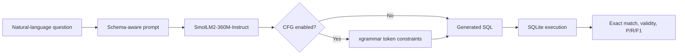

# Text-to-SQL with SmolLM2

LoRA fine-tuning, execution-based evaluation, and grammar-constrained decoding for semantic parsing.

**Hongyu Zhou · MRes Computer Science**

[English](#english) | [中文](#中文)

[View the complete notebook](llm_for_sql.ipynb)

## English

### Overview

This project investigates whether a compact language model can translate natural-language questions into executable SQL. It adapts [`HuggingFaceTB/SmolLM2-360M-Instruct`](https://huggingface.co/HuggingFaceTB/SmolLM2-360M-Instruct) to the GeoQuery geography domain and compares prompting, parameter-efficient fine-tuning, and context-free grammar (CFG) constrained decoding.

The strongest configuration improved development-set exact match from **34.69% to 69.39%** and micro F1 from **0.1613 to 0.5567**, while training only **13.1M parameters (3.50%)**. On the held-out test set, it achieved **38.35% exact match** and **90.32% executable SQL**.

### What I Built

- An end-to-end GeoQuery pipeline that expands variable placeholders and preserves the official train/dev/test split.
- Schema-aware zero-shot and few-shot prompts for a 360M-parameter instruction model.
- LoRA adapters for the attention projections (`q_proj`, `k_proj`, `v_proj`, and `o_proj`).
- A custom completion-only collator that masks prompt tokens so training loss is computed only on the SQL answer.
- An execution-based evaluator that runs generated SQL against SQLite and reports precision, recall, F1, exact match, and grammatical validity.
- An `xgrammar` EBNF grammar and Hugging Face logits processor for constrained decoding.
- Four-way ablation experiments and error analysis covering prompting, fine-tuning, and CFG constraints.

### System Flow



### Results

All values below are taken from the saved notebook outputs. Generation uses greedy decoding for reproducibility. Exact match compares query results rather than requiring identical SQL strings, and executable SQL is the proportion of generated queries accepted by SQLite.

#### Development set ablation (49 examples)

| Configuration | Exact Match | Executable SQL | Micro F1 | Macro F1 |
|---|---:|---:|---:|---:|
| Base model + few-shot prompting | 34.69% | 79.59% | 0.1613 | 0.3376 |
| **LoRA + zero-shot inference** | **69.39%** | **89.80%** | **0.5567** | **0.7005** |
| Base model + few-shot + CFG | 26.53% | 59.18% | 0.1333 | 0.2472 |
| LoRA + few-shot + CFG | 8.16% | 12.24% | 0.4622 | 0.0639 |

LoRA produced a **34.70 percentage-point gain** in exact match and a **0.3954 absolute gain** in micro F1 over the prompting baseline.

#### Held-out test set (279 examples)

| Configuration | Exact Match | Executable SQL | Micro F1 | Macro F1 |
|---|---:|---:|---:|---:|
| **LoRA + few-shot inference** | **38.35%** | **90.32%** | **0.3390** | **0.4091** |
| LoRA + few-shot + CFG | 3.94% | 4.30% | 0.0060 | 0.0084 |


#### Main finding

Parameter-efficient fine-tuning clearly outperformed prompting alone. The CFG ablation did not improve this setup: the grammar reduced coverage and frequently produced unusable outputs. This negative result shows that constrained decoding only helps when the grammar, tokenizer integration, prompt format, and SQL extraction logic agree exactly. A broader SQL grammar and dedicated constraint-state tests are the next steps.

### Training Configuration

| Component | Configuration |
|---|---|
| Base model | `HuggingFaceTB/SmolLM2-360M-Instruct` (361.8M parameters) |
| Dataset | GeoQuery: 549 train / 49 dev / 279 test |
| Fine-tuning | LoRA rank 64, alpha 128, dropout 0.1 |
| Trainable parameters | 13,107,200 / 374,928,320 (3.50%) |
| Optimisation | 5 epochs, learning rate `2e-4`, cosine schedule, 10% warm-up |
| Effective batch size | 16 (batch size 4 x 4 gradient accumulation steps) |
| Sequence length | 512 tokens |
| Objective | Completion-only causal language modelling |
| Best validation loss | 0.065445 at epoch 5 |
| Training time | 3:08 for 175 steps in the recorded run |

### Evaluation Design

For each question, the evaluator:

1. Builds a prompt containing the database schema and, for inference, five demonstrations.
2. Generates SQL deterministically with greedy decoding.
3. Extracts the `SELECT` statement and executes it against the GeoQuery SQLite database.
4. Compares predicted and gold result sets to calculate micro/macro precision, recall, and F1.
5. Records result-set exact match, SQL executability, and representative syntax or semantic failures.

This execution-based approach gives semantically equivalent queries credit even when their SQL strings differ.

### Run the Project

A CUDA-capable GPU is strongly recommended. The recorded notebook used Python 3.11, PyTorch with CUDA, and the following core libraries:

```text
transformers
datasets
trl
peft
xgrammar
pandas
```

1. Clone the repository.
2. Open [`llm_for_sql.ipynb`](llm_for_sql.ipynb) in Jupyter, Google Colab, or Kaggle.
3. Select a GPU runtime.
4. Run the cells from top to bottom.

The notebook installs its dependencies, downloads the GeoQuery assets when they are missing, trains the LoRA adapter, and runs the evaluation suite. The saved outputs make the reported experiment inspectable without retraining.

### Repository Structure

```text
.
|-- llm_for_sql.ipynb          # Complete experiment and saved outputs
|-- smollm2-sql-lora-adapter/  # Saved PEFT adapter artifacts
|-- smollm2-sql-lora/          # Trainer checkpoints and model artifacts
`-- README.md
```

### Limitations and Next Steps

- GeoQuery covers one small domain, so the results do not yet demonstrate cross-database generalisation.
- The development set contains only 49 examples; repeated runs with fixed seeds would give a stronger estimate of variance.
- The current EBNF grammar supports only a subset of the SQL patterns present in the dataset.
- Future work should add schema-linking tests, grammar unit tests, batched inference, and evaluation on Spider or BIRD.

### Data and References

- GeoQuery data and SQLite database: [text2sql-data](https://github.com/jkkummerfeld/text2sql-data)
- Base model: [SmolLM2-360M-Instruct](https://huggingface.co/HuggingFaceTB/SmolLM2-360M-Instruct)
- Parameter-efficient fine-tuning: [PEFT](https://github.com/huggingface/peft)
- Constrained decoding: [xgrammar](https://github.com/mlc-ai/xgrammar)

## 中文

### 项目概述

本项目研究小型语言模型能否将自然语言问题转换为可执行 SQL。项目基于 GeoQuery 地理数据库，对 `HuggingFaceTB/SmolLM2-360M-Instruct` 进行 LoRA 参数高效微调，并对比少样本提示、微调以及基于 `xgrammar` 的上下文无关文法约束解码。

最佳配置将开发集执行结果完全匹配率从 **34.69% 提升至 69.39%**，Micro F1 从 **0.1613 提升至 0.5567**，同时只训练 **1310 万个参数，占总参数的 3.50%**。在独立测试集上，模型达到 **38.35% 完全匹配率**和 **90.32% SQL 可执行率**。

### 我完成的工作

- 构建 GeoQuery 数据处理流程，展开变量占位符并保留官方训练、开发和测试划分。
- 为 3.6 亿参数指令模型设计包含数据库 Schema 的 zero-shot 与 few-shot 提示。
- 在注意力层的 `q_proj`、`k_proj`、`v_proj` 和 `o_proj` 上应用 LoRA。
- 实现 completion-only collator，屏蔽提示词 token，只对 SQL 答案计算训练损失。
- 实现基于 SQLite 执行结果的评估器，统计 Precision、Recall、F1、完全匹配率和 SQL 可执行率。
- 使用 EBNF 与 `xgrammar` 实现 CFG 约束解码，并完成四组消融实验及错误分析。

### 实验结果

下列结果均来自 notebook 中保存的真实运行输出。完全匹配按 SQL 查询结果比较，因此语义等价但写法不同的 SQL 也能得到正确评价。

#### 开发集消融实验（49 条）

| 配置 | 完全匹配率 | SQL 可执行率 | Micro F1 | Macro F1 |
|---|---:|---:|---:|---:|
| 基础模型 + few-shot | 34.69% | 79.59% | 0.1613 | 0.3376 |
| **LoRA + zero-shot 推理** | **69.39%** | **89.80%** | **0.5567** | **0.7005** |
| 基础模型 + few-shot + CFG | 26.53% | 59.18% | 0.1333 | 0.2472 |
| LoRA + few-shot + CFG | 8.16% | 12.24% | 0.4622 | 0.0639 |

#### 测试集结果（279 条）

| 配置 | 完全匹配率 | SQL 可执行率 | Micro F1 | Macro F1 |
|---|---:|---:|---:|---:|
| **LoRA + few-shot 推理** | **38.35%** | **90.32%** | **0.3390** | **0.4091** |
| LoRA + few-shot + CFG | 3.94% | 4.30% | 0.0060 | 0.0084 |

#### Phase 3 和 Phase 4 的结论

是的，当前 notebook 中 Phase 3 和 Phase 4 的 CFG 跑分都不理想：

- **Phase 3：LoRA + CFG。** 开发集完全匹配率只有 8.16%，SQL 可执行率为 12.24%；对应的 LoRA 无 CFG 配置分别达到 69.39% 和 89.80%。虽然 Micro F1 仍有 0.4622，但整体结果明显退化。
- **Phase 4：基础模型 + CFG。** 开发集完全匹配率从无 CFG 的 34.69% 降至 26.53%，SQL 可执行率从 79.59% 降至 59.18%，Micro F1 也从 0.1613 降至 0.1333。
- 测试集上的 LoRA + CFG 同样下降到 3.94% 完全匹配率和 4.30% SQL 可执行率。

这些结果说明当前 EBNF 覆盖范围、tokenizer 约束状态、提示格式和 SQL 抽取逻辑之间存在不匹配，而不是证明 CFG 方法本身无效。这个负结果构成了一项有价值的消融实验，也给出了明确的后续优化方向。

### 训练配置

| 项目 | 配置 |
|---|---|
| 基础模型 | `HuggingFaceTB/SmolLM2-360M-Instruct`，3.618 亿参数 |
| 数据集 | GeoQuery：549 train / 49 dev / 279 test |
| LoRA | rank 64，alpha 128，dropout 0.1 |
| 可训练参数 | 13,107,200 / 374,928,320，约 3.50% |
| 优化配置 | 5 epochs，学习率 `2e-4`，cosine scheduler，10% warm-up |
| 有效 batch size | 16，即 batch size 4 x 梯度累积 4 |
| 最大序列长度 | 512 tokens |
| 训练目标 | Completion-only causal language modelling |
| 最佳验证损失 | epoch 5 时为 0.065445 |
| 记录的训练时间 | 175 steps，共 3 分 08 秒 |

### 评估方法

1. 使用数据库 Schema 和五个示例构造推理提示。
2. 通过 greedy decoding 确保生成结果可复现。
3. 提取生成的 `SELECT` 语句并在 GeoQuery SQLite 数据库中执行。
4. 比较预测与标准查询的结果集合，计算 Micro/Macro Precision、Recall 和 F1。
5. 记录执行结果完全匹配率、SQL 可执行率以及语法或语义错误案例。

### 运行项目

建议使用支持 CUDA 的 GPU。打开 [`llm_for_sql.ipynb`](llm_for_sql.ipynb) 后按顺序运行全部单元格。notebook 会自动安装依赖、下载缺失的 GeoQuery 数据、训练 LoRA adapter，并完成全部评估。

主要依赖包括 PyTorch、Transformers、Datasets、TRL、PEFT、xgrammar 和 pandas。CPU 可以执行数据处理，但不适合完成本项目的微调实验。

### 仓库结构

```text
.
|-- llm_for_sql.ipynb          # 完整实验与已保存输出
|-- smollm2-sql-lora-adapter/  # PEFT adapter 产物
|-- smollm2-sql-lora/          # Trainer checkpoints 与模型产物
`-- README.md
```

### 局限与下一步

- GeoQuery 只覆盖单一的小型地理领域，暂时不能证明跨数据库泛化能力。
- 开发集只有 49 条样本，后续应固定随机种子并进行多次重复实验。
- 当前 EBNF grammar 只覆盖数据集中部分 SQL 模式，需要增加 grammar 单元测试和更完整的 SQL 结构。
- 后续可加入 schema linking、批量推理，并在 Spider 或 BIRD 上进行评估。

### 数据与参考资料

- GeoQuery 数据与 SQLite 数据库：[text2sql-data](https://github.com/jkkummerfeld/text2sql-data)
- 基础模型：[SmolLM2-360M-Instruct](https://huggingface.co/HuggingFaceTB/SmolLM2-360M-Instruct)
- 参数高效微调：[PEFT](https://github.com/huggingface/peft)
- 约束解码：[xgrammar](https://github.com/mlc-ai/xgrammar)
